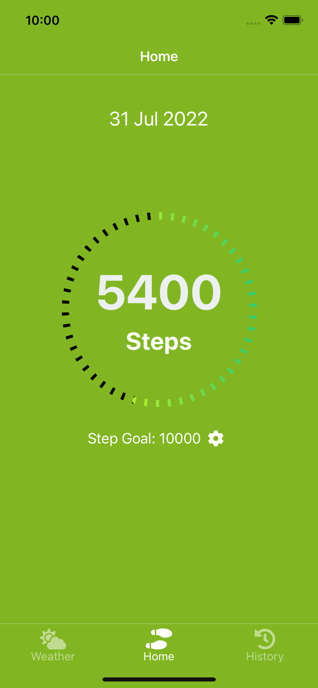
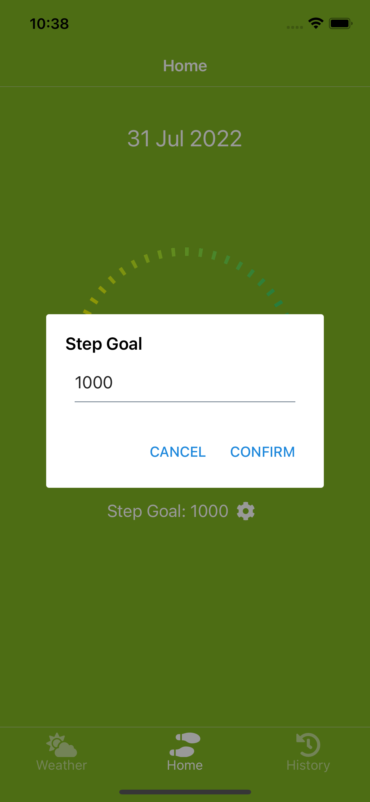
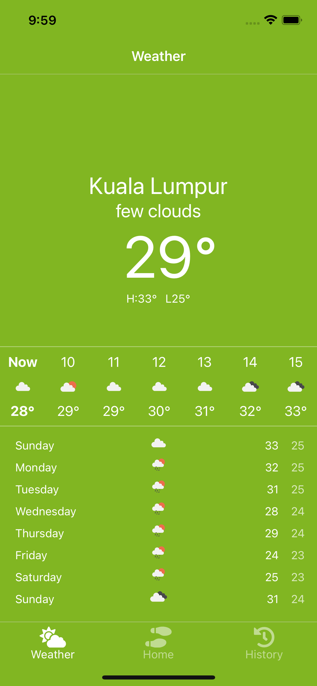
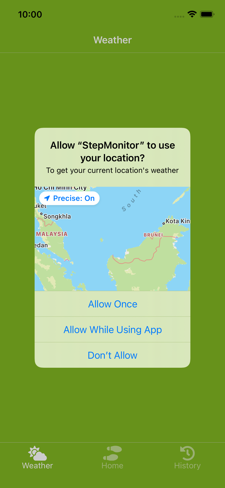
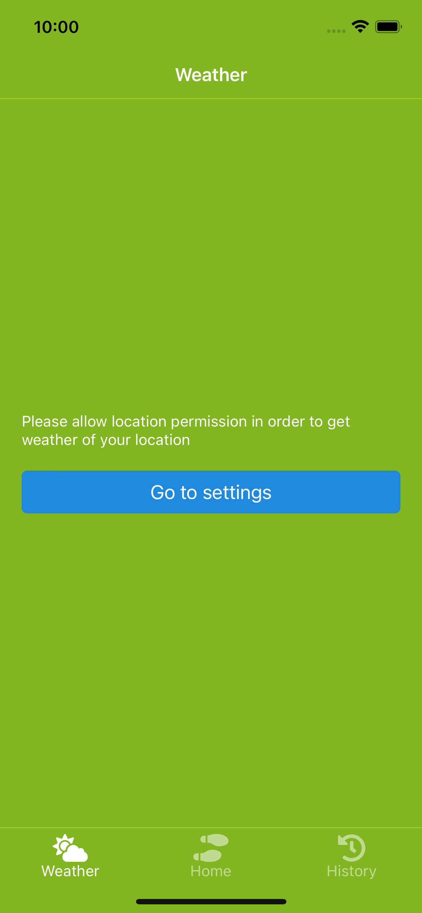
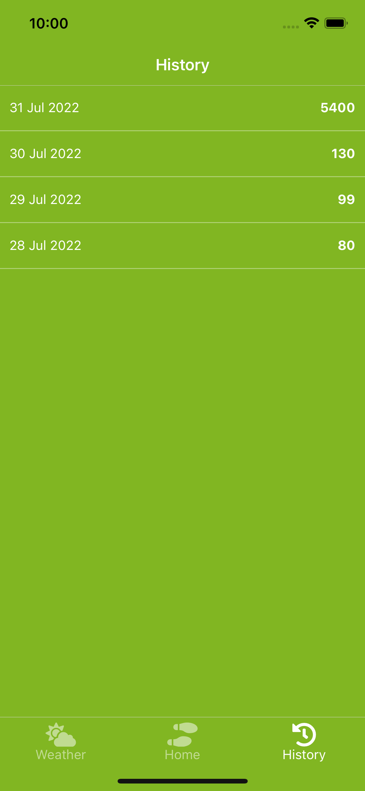

## Step Monitor

## Home screen


<p>Showing today step count and step goal</p>

## Edit step goal


<p>Edit step goal, default 1000</p>

#

## Weather screen


<p>View your current location's weather</p>
 
## Location permissison


<p>StepMonitor need Location permission in order to get user current location, native iOS location permission dialog will be show</p>

## Denied location permission screen


<p>If location permission denied by user, showing this screen and tap to navigate  to setting</p>

#

## History


<p>View your last 7 days step count history</p>

# Installation

```shell
$ npm install
$ cd ios
$ pod install
$ npm run ios
```
